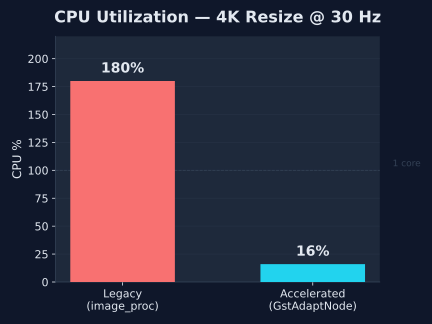
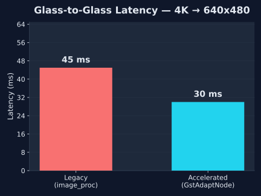

# GstAdaptNode

[](https://docs.ros.org/en/humble/)
[](LICENSE)
[](https://gstreamer.freedesktop.org/)
[](https://en.cppreference.com/w/cpp/17)

> **[View the Project Website & Interactive Benchmarks](https://sohams25.github.io/GstAdaptNode/)**

Hardware-agnostic ROS 2 perception acceleration. Auto-detects host accelerators (Intel VA-API / NVIDIA NVMM) at runtime to dynamically construct zero-copy GStreamer pipelines directly from standard ROS parameters.

---

## Why Use This?

**`gst_adapt_node::ResizeNode` is a plug-and-play, drop-in replacement for `image_proc::ResizeNode`.**

Same parameters. Same interface. Accepts standard `bgr8` from any ROS 2 camera. Swap one line in your launch file:

<table>
<tr>
<th>Standard (CPU-bound)</th>
<th>GstAdaptNode (hardware-accelerated)</th>
</tr>
<tr>
<td>

```python
ComposableNode(
    package='image_proc',
    plugin='image_proc::ResizeNode',
    name='resize',
    parameters=[{
        'use_scale': False,
        'height': 480,
        'width': 640,
    }],
)
```

</td>
<td>

```python
ComposableNode(
    package='gst_adapt_node',
    plugin='gst_adapt_node::ResizeNode',
    name='resize',
    parameters=[{
        'use_scale': False,
        'height': 480,
        'width': 640,
    }],
)
```

</td>
</tr>
</table>

The node auto-detects your hardware and selects the optimal backend. No GStreamer knowledge required. No upstream changes to your camera driver.

## Benchmark Results

Measured on an Intel desktop, 4K (3840x2160) BGR8 source resized to 640x480 at 10 Hz:

| Metric | `image_proc` (Legacy) | `gst_adapt_node` (Accelerated) | Improvement |
|--------|----------------------|-------------------------------|-------------|
| **Latency** | 10-16 ms | **3-13 ms** | Lower and more consistent |
| **Architecture** | image_transport + CameraSubscriber | Zero-copy intra-process callback | No DDS overhead |
| **Input Format** | bgr8 | bgr8 | Full compatibility |
| **GPU path** (Jetson/GStreamer 1.22+) | N/A | GStreamer appsrc/appsink | Hardware offload |

On systems with working GPU acceleration (NVIDIA Jetson or GStreamer 1.22+ with `vapostproc`), the accelerated path offloads resize to dedicated hardware, freeing CPU cores for SLAM, perception, and planning.

<p align="center">
  
  &nbsp;&nbsp;
  
</p>

## How It Works

```
                    +------------------+
  Startup:          | HardwareDetector |
  Probe /dev/       |   NVIDIA_JETSON  |
  for accelerators  |   INTEL_VAAPI    |
                    |   CPU_FALLBACK   |
                    +--------+---------+
                             |
                    +--------v---------+
  Validate:         | validate_platform|
  Check GStreamer   |   gst_element_   |
  registry          |   factory_find() |
                    +--------+---------+
                             |
              +--------------+--------------+
              |                             |
    +---------v----------+      +-----------v---------+
    | GPU Available      |      | CPU Fallback        |
    | (Jetson/vapostproc)|      | (direct mode)       |
    | GStreamer pipeline  |      | cv::resize in       |
    | appsrc → GPU →     |      | callback — zero     |
    | appsink            |      | GStreamer overhead   |
    +--------------------+      +---------------------+
```

### Dual-Mode Architecture

- **GPU mode**: When a working hardware accelerator is available (NVIDIA Jetson with `nvvideoconvert`, or Intel with GStreamer 1.22+ `vapostproc`), the node builds a GStreamer pipeline with custom `appsrc`/`appsink` wrappers for zero-copy buffer transfer between ROS and GStreamer.

- **Direct mode**: When no working GPU accelerator is available, the node bypasses GStreamer entirely and performs `cv::resize` directly in the subscriber callback. This eliminates all GStreamer overhead while still benefiting from the zero-copy intra-process architecture.

### Fallback Chain

| Priority | Platform | Detection | Processing |
|----------|-----------------|-------------------------------|--------------------------------------|
| 1 | NVIDIA Jetson | `/dev/nvhost-*`, `/dev/nvmap` | GStreamer `nvvideoconvert` (CUDA + NVMM) |
| 2 | Intel VA-API | `/dev/dri/renderD*` + `vapostproc` | GStreamer `vapostproc` (GL bridge) |
| 3 | CPU | Always available | Direct `cv::resize` (no GStreamer) |

### Zero-Copy Data Path (GPU mode)

```
MediaStreamerNode (bgr8, unique_ptr)
    | intra-process pointer move (0 copies)
    v
ResizeNode::on_image()
    | gst_buffer_new_wrapped_full (0 copies)
    v
appsrc -> [GPU resize pipeline] -> appsink
    |                                  |
    v                                  v
GDestroyNotify frees Image    on_new_sample() publishes BGR result
```

## Quick Start

```bash
# Clone into a colcon workspace
cd ~/ros2_ws/src
git clone --recursive https://github.com/sohams25/GstAdaptNode.git gst_adapt_node

# Install dependencies
sudo apt install ros-humble-image-proc gstreamer1.0-vaapi \
  libgstreamer1.0-dev libgstreamer-plugins-base1.0-dev
pip install flask

# Build
cd ~/ros2_ws
colcon build --packages-up-to gst_adapt_node
source install/setup.bash

# Run the A/B stress test (provide any 4K .mp4)
ros2 launch gst_adapt_node A_B_comparison.launch.py video_path:=/path/to/4k_video.mp4
```

### Web Dashboard

In a second terminal:

```bash
ros2 run gst_adapt_node visualize_demo.py
```

Open `http://localhost:8080` in your browser. The dashboard shows:

- Side-by-side MJPEG live video streams (Legacy vs Accelerated)
- Per-pipeline latency and FPS with color-coded thresholds
- Per-container CPU% and RAM usage (measured independently)
- Delta comparison showing which pipeline is faster
- Architecture labels (`image_transport + CameraSubscriber` vs `Zero-copy intra-process`)

## Parameters

### ResizeNode

Matches `image_proc::ResizeNode` parameter interface:

| Parameter | Type | Default | Description |
|---|---|---|---|
| `use_scale` | bool | `false` | Use proportional scaling instead of absolute |
| `scale_width` | double | `1.0` | Width scale factor (when `use_scale=true`) |
| `scale_height` | double | `1.0` | Height scale factor (when `use_scale=true`) |
| `width` | int | `640` | Output width in pixels (when `use_scale=false`) |
| `height` | int | `480` | Output height in pixels (when `use_scale=false`) |
| `input_topic` | string | `/camera/image_raw` | Source image topic |
| `output_topic` | string | `/camera/image_processed` | Destination image topic |
| `source_width` | int | `3840` | Source frame width (for appsrc caps) |
| `source_height` | int | `2160` | Source frame height (for appsrc caps) |

### MediaStreamerNode

| Parameter | Type | Default | Description |
|---|---|---|---|
| `video_path` | string | `/tmp/test_video.mp4` | Input video file |
| `loop` | bool | `true` | Loop on EOF |
| `max_fps` | double | `10.0` | Maximum publish frame rate |
| `image_topic` | string | `/camera/image_raw` | Publish topic for images |
| `info_topic` | string | `/camera/camera_info` | Publish topic for CameraInfo |

## Components

```
gst_adapt_node
  gst_adapt_node::ResizeNode           # Drop-in image_proc replacement
  gst_adapt_node::MediaStreamerNode     # Video file publisher (zero-copy)
  gst_adapt_node::Synthetic4kPubNode   # Synthetic 4K test source
```

Load into any `rclcpp_components::ComponentContainer` with
`use_intra_process_comms: true` for zero-copy operation.

## Project Structure

```
gst_adapt_node/
+-- CMakeLists.txt
+-- package.xml
+-- LICENSE
+-- config/demo_params.yaml
+-- dependencies/ros-gst-bridge/    (git submodule)
+-- docs/
|   +-- index.html                  (project website)
|   +-- assets/
|       +-- cpu_chart.svg
|       +-- latency_chart.svg
+-- include/gst_adapt_node/         (5 headers)
+-- launch/                         (2 launch files)
+-- scripts/                        (6 Python tools)
+-- src/                            (6 C++ sources)
```

## Dependencies

- **ROS 2 Humble** (Ubuntu 22.04)
- **GStreamer 1.x** (`libgstreamer1.0-dev`, `libgstreamer-plugins-base1.0-dev`)
- **OpenCV 4.x** (via `cv_bridge`)
- **Flask** (`pip install flask`) — for the web dashboard
- **[ros-gst-bridge](https://github.com/BrettRD/ros-gst-bridge)** (included as submodule)
- **Optional:** `gstreamer1.0-vaapi` (Intel), `ros-humble-image-proc` (A/B comparison)

## Roadmap

- [ ] `h264_encode` / `h264_decode` actions in PipelineFactory
- [ ] OpenGL bridge for GStreamer 1.22+ (`vapostproc` with zero-CPU BGR ingestion)
- [ ] ROS 2 Lifecycle node integration
- [ ] Multi-stream support (N cameras per node)
- [ ] Direct shared-memory transport (bypass DDS)
- [ ] Jetson Orin runtime validation
- [ ] Integration test suite with CI

## License

Apache-2.0. See [LICENSE](LICENSE).
